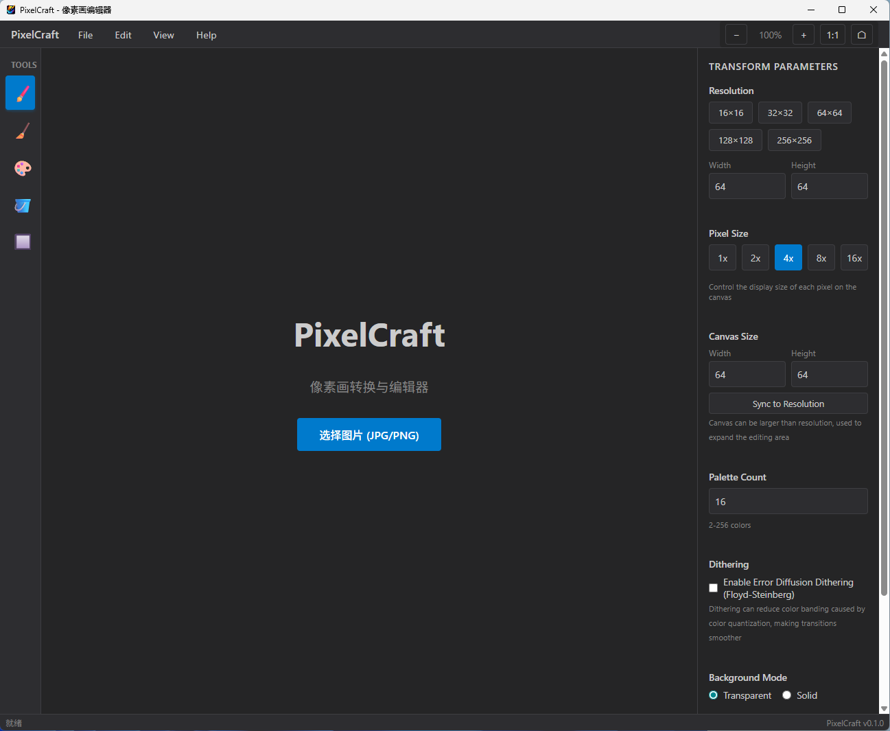
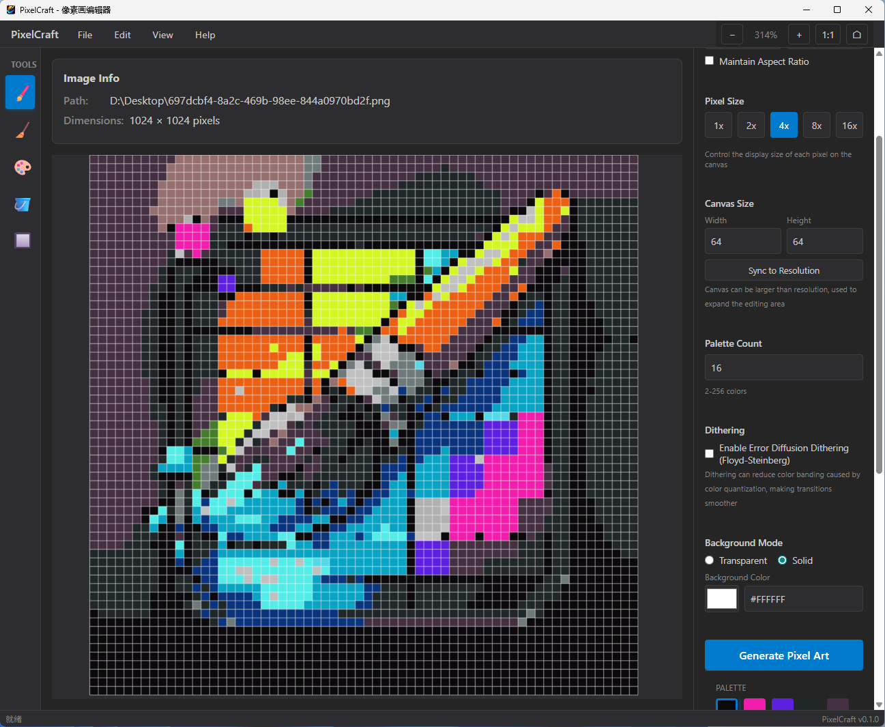
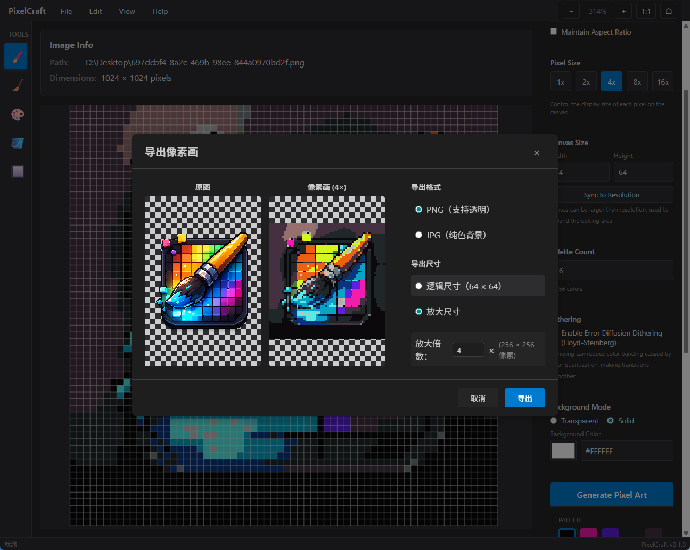

<div align="center">

# 🎨 PixelCraft

**强大的桌面像素画转换与编辑器**

[](https://opensource.org/licenses/MIT)
[](https://www.typescriptlang.org/)
[](https://www.rust-lang.org/)
[](https://tauri.app/)
[](https://reactjs.org/)

[English](README.md) | [中文](#)



**将图片转换为像素画，并使用专业工具进行编辑**

[功能特性](#-功能特性) • [安装](#-安装) • [使用](#-使用) • [开发](#-开发) • [贡献](#-贡献)

</div>

---

## 📖 目录

- [关于](#-关于)
- [功能特性](#-功能特性)
- [截图](#-截图)
- [安装](#-安装)
- [使用](#-使用)
- [快捷键](#-快捷键)
- [开发](#-开发)
- [项目结构](#-项目结构)
- [技术栈](#-技术栈)
- [构建](#-构建)
- [贡献](#-贡献)
- [许可证](#-许可证)
- [致谢](#-致谢)

## 🎯 关于

PixelCraft 是一款现代化的跨平台桌面应用程序，可以将普通图片转换为像素画，并提供完整的编辑套件。使用 Tauri 2、React 和 Rust 构建，它结合了原生性能的强大功能和美观、响应式的用户界面。

### 为什么选择 PixelCraft？

- **🖼️ 高质量转换**：先进的颜色量化和抖动算法
- **🖌️ 功能完整的编辑器**：专业的像素画编辑工具
- **💾 项目管理**：将作品保存为 `.pixproj` 文件
- **🌍 跨平台**：支持 Windows、macOS 和 Linux
- **⚡ 原生性能**：使用 Rust 构建，图像处理速度快
- **🎨 现代界面**：简洁直观的界面，支持深色/浅色主题

## ✨ 功能特性

### 核心功能

- **🖼️ 图片转像素画**
  - 支持 JPG 和 PNG 格式
  - 可自定义分辨率（宽 × 高）
  - 调色板量化（2-256 种颜色）
  - Floyd-Steinberg 误差扩散抖动
  - 最近邻缩放算法

- **🎨 高级像素编辑器**
  - **画笔工具**：使用可自定义大小的画笔绘制像素
  - **橡皮工具**：精确擦除像素
  - **吸管工具**：从画布上拾取颜色
  - **油漆桶工具**：使用洪水填充算法填充区域
  - **框选工具**：选择和操作像素区域
  - **镜像绘制**：水平和垂直镜像模式

- **💾 项目管理**
  - 将项目保存为 `.pixproj` 文件
  - 加载和恢复之前的工作
  - 最近项目列表
  - 未保存更改指示器
  - 文件关联支持（双击打开）

- **📤 导出选项**
  - 导出为 PNG（支持透明）
  - 导出为 JPG（可控制质量）
  - 自定义导出尺寸
  - 导出前预览

### 用户体验

- **🌓 主题支持**：深色和浅色主题，支持系统偏好检测
- **⌨️ 可自定义快捷键**：完全可自定义的键盘快捷键
- **🌍 国际化**：支持英文和简体中文
- **📐 窗口状态记忆**：自动保存和恢复窗口位置和大小
- **📝 命令行支持**：通过命令行参数打开文件
- **💬 提示通知**：用户友好的反馈系统
- **📊 状态栏**：实时信息显示

### 桌面集成

- **📁 文件关联**：双击 `.pixproj` 文件即可打开
- **📝 命令行**：从终端/命令提示符打开文件
- **🪟 窗口管理**：记住会话之间的窗口状态

## 📸 截图

### 主界面


### 编辑器视图


### 导出对话框


## 📦 安装

### Windows

1. 从 [Releases](https://github.com/Huangjp0915/PixelCraft/releases) 下载最新版本
2. 运行安装程序（`.msi` 或 `.exe`）
3. 按照安装向导操作
4. 从开始菜单启动 PixelCraft

```

## 🚀 使用

### 基本工作流程

1. **导入图片**
   - 点击"导入图片"按钮
   - 或将图片文件拖放到窗口中
   - 支持的格式：JPG、PNG

2. **调整参数**
   - **分辨率**：设置目标像素画尺寸
   - **像素大小**：控制画布上每个像素的显示大小
   - **调色板数量**：选择颜色数量（2-256）
   - **抖动**：启用/禁用误差扩散抖动
   - **背景**：选择透明或纯色背景

3. **生成像素画**
   - 点击"生成像素画"按钮
   - 等待处理完成
   - 像素画将出现在编辑器中

4. **编辑您的作品**
   - 使用左侧工具栏的工具：
     - **B** - 画笔工具
     - **E** - 橡皮工具
     - **I** - 吸管工具
     - **P** - 油漆桶工具
     - **S** - 框选工具
   - 从调色板中选择颜色
   - 使用缩放和平移进行导航

5. **保存您的工作**
   - **保存工程**（Ctrl+S）：保存为 `.pixproj` 文件
   - **另存为**（Ctrl+Shift+S）：保存到新位置
   - **导出**（Ctrl+E）：导出为 PNG 或 JPG

### 高级功能

#### 工程文件
- 将您的工作保存为 `.pixproj` 文件
- 包括源图片路径、转换设置和像素文档
- 双击 `.pixproj` 文件在 PixelCraft 中打开

#### 可自定义快捷键
- 按 **F1** 打开帮助对话框
- 查看所有可用快捷键
- 在设置中自定义快捷键（即将推出）

#### 主题切换
- 在深色和浅色主题之间切换
- 主题偏好会自动保存

## ⌨️ 快捷键

| 操作 | 快捷键 | 说明 |
|------|--------|------|
| **文件操作** |
| 新建工程 | `Ctrl+N` | 创建新工程 |
| 打开工程 | `Ctrl+O` | 打开现有工程 |
| 保存工程 | `Ctrl+S` | 保存当前工程 |
| 另存为 | `Ctrl+Shift+S` | 将工程保存到新位置 |
| 导出 | `Ctrl+E` | 导出为图片 |
| **编辑操作** |
| 撤销 | `Ctrl+Z` | 撤销上一个操作 |
| 重做 | `Ctrl+Y` | 重做上一个操作 |
| 删除 | `Delete` | 删除选中的像素 |
| **工具** |
| 画笔 | `B` | 切换到画笔工具 |
| 橡皮 | `E` | 切换到橡皮工具 |
| 吸管 | `I` | 切换到吸管工具 |
| 油漆桶 | `P` | 切换到油漆桶工具 |
| 框选 | `S` | 切换到框选工具 |
| **视图** |
| 放大 | `Ctrl+=` | 放大画布 |
| 缩小 | `Ctrl+-` | 缩小画布 |
| 重置缩放 | `Ctrl+0` | 将缩放重置为 100% |
| 切换网格 | `G` | 显示/隐藏像素网格 |
| 平移画布 | `Space + 拖拽` | 平移画布 |
| **帮助** |
| 帮助对话框 | `F1` | 打开帮助对话框 |

## 🛠️ 开发

### 前置要求

- **Node.js** 18+ 和 npm
- **Rust** 1.70+ ([rustup](https://rustup.rs/))
- **Tauri CLI**: `npm install -g @tauri-apps/cli@latest`

### 平台特定要求

#### Windows
- Microsoft Visual C++ Build Tools 或 Visual Studio 2019+
- Windows SDK

### 快速开始

1. **克隆仓库**
   ```bash
   git clone https://github.com/Huangjp0915/PixelCraft.git
   cd PixelCraft
   ```

2. **安装依赖**
   ```bash
   npm install
   ```

3. **运行开发模式**
   ```bash
   npm run tauri dev
   ```

4. **构建生产版本**
   ```bash
   npm run tauri build
   ```

### 开发脚本

```bash
# 开发
npm run dev          # 启动 Vite 开发服务器
npm run tauri dev    # 启动 Tauri 开发模式

# 构建
npm run build        # 仅构建前端
npm run tauri build  # 构建完整应用程序

# 代码质量
npm run lint         # 运行 ESLint
npm run format       # 使用 Prettier 格式化代码
```

### 项目结构

```
PixelCraft/
├── src/                    # 前端源代码
│   ├── app/               # 主应用组件
│   ├── components/        # React 组件
│   │   ├── about/         # 关于对话框
│   │   ├── common/        # 通用 UI 组件
│   │   ├── editor/        # 编辑器组件
│   │   ├── export/        # 导出对话框
│   │   ├── help/          # 帮助对话框
│   │   ├── import/         # 导入组件
│   │   ├── layout/        # 布局组件
│   │   ├── palette/        # 调色板编辑器
│   │   └── transform/     # 转换控件
│   ├── hooks/             # React Hooks
│   ├── locales/           # 国际化
│   ├── services/          # 服务层
│   ├── store/             # Zustand 状态管理
│   ├── styles/            # 全局样式
│   ├── types/             # TypeScript 类型
│   └── utils/            # 工具函数
├── src-tauri/             # Rust 后端
│   ├── src/
│   │   ├── commands/      # Tauri 命令
│   │   ├── errors/        # 错误类型
│   │   ├── image_core/     # 图像处理
│   │   ├── models/        # 数据模型
│   │   └── main.rs        # 入口点
│   ├── icons/             # 应用程序图标
│   ├── capabilities/      # Tauri 权限
│   └── tauri.conf.json    # Tauri 配置
├── docs/                  # 文档
├── scripts/               # 构建脚本
└── package.json           # Node.js 依赖
```

## 🏗️ 技术栈

### 前端
- **React 18.3** - UI 框架
- **TypeScript 5.5** - 类型安全
- **Vite 5.4** - 构建工具和开发服务器
- **Konva 10.0** - 2D 画布库
- **React Konva 18.2** - Konva 的 React 绑定
- **Zustand 5.0** - 状态管理
- **React Router 6.26** - 路由（如需要）

### 后端
- **Rust 1.70+** - 系统编程
- **Tauri 2.1** - 桌面框架
- **image 0.25** - 图像处理
- **color_quant 1.1** - 颜色量化（NeuQuant）
- **serde 1.0** - 序列化

### 开发工具
- **ESLint** - 代码检查
- **Prettier** - 代码格式化
- **TypeScript** - 类型检查

## 🔨 构建

### 构建所有平台
```bash
npm run tauri build
```

### 构建特定平台

#### Windows
```bash
npm run tauri build -- --target x86_64-pc-windows-msvc
```

#### macOS
```bash
# Intel
npm run tauri build -- --target x86_64-apple-darwin

# Apple Silicon
npm run tauri build -- --target aarch64-apple-darwin
```

#### Linux
```bash
npm run tauri build -- --target x86_64-unknown-linux-gnu
```

### 输出位置

- **Windows**: `src-tauri/target/release/bundle/msi/` 或 `nsis/`
- **macOS**: `src-tauri/target/release/bundle/macos/`
- **Linux**: `src-tauri/target/release/bundle/appimage/` 或 `deb/`

## 🤝 贡献

欢迎贡献！请随时提交 Pull Request。

### 如何贡献

1. Fork 仓库
2. 创建您的功能分支（`git checkout -b feature/AmazingFeature`）
3. 提交您的更改（`git commit -m '添加一些 AmazingFeature'`）
4. 推送到分支（`git push origin feature/AmazingFeature`）
5. 打开 Pull Request

### 开发指南

- 遵循现有的代码风格
- 编写有意义的提交消息
- 为新功能添加测试（如适用）
- 根据需要更新文档
- 确保在提交 PR 前所有检查都通过

### 报告问题

如果您发现错误或有功能请求，请在 [GitHub Issues](https://github.com/Huangjp0915/PixelCraft/issues) 上打开一个问题。

## 📄 许可证

本项目采用 MIT 许可证 - 有关详细信息，请参阅 [LICENSE](LICENSE) 文件。

## 🙏 致谢

- **Tauri 团队** - 提供出色的桌面框架
- **React 团队** - 提供 UI 框架
- **Konva 团队** - 提供画布库
- **Rust 社区** - 提供优秀的 crate 和工具
- 所有支持此项目的贡献者和用户

## 📞 联系方式与链接

- **GitHub**: [@Huangjp0915](https://github.com/Huangjp0915)
- **仓库**: [PixelCraft](https://github.com/Huangjp0915/PixelCraft)
- **问题反馈**: [报告 Bug](https://github.com/Huangjp0915/PixelCraft/issues)

---

<div align="center">

**由 PixelCraft 团队用 ❤️ 制作**

如果您觉得这个项目有帮助，请 [⭐ 给这个仓库点个星](https://github.com/Huangjp0915/PixelCraft)！

</div>
